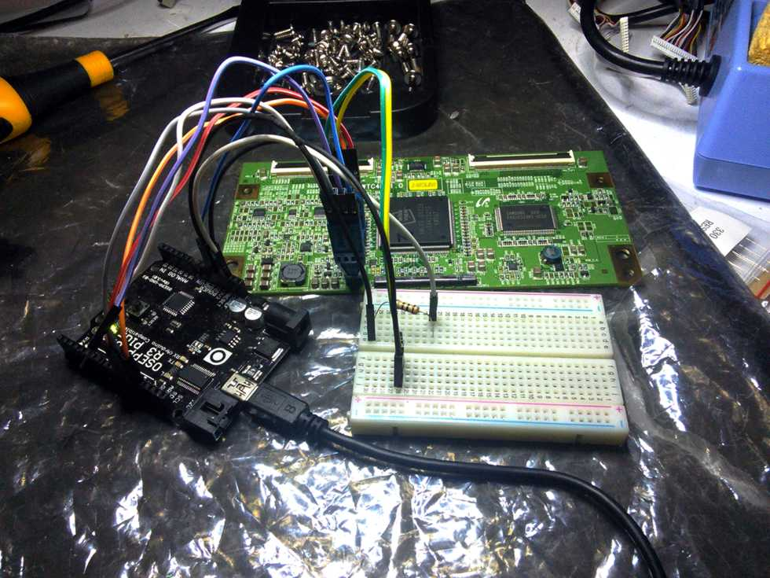

spi-dump
========

spi-dump is a commandline utility for dumping SPI EEPROMs, using an Arduino as a
bridge between a console and SPI bus.



There are quite a few quick tutorials and code snippets floating around
demonstrating how to use an Arduino to interface with SPI EEPROMs, but all that
I've come across implement the majority of the logic on the Arduino side. I
found this to be problematic for a couple of reasons:

 * **Arduinos are difficult to debug**: If your sketch crashes, it can be
   non-trivial to work out why. This can be particularly frustrating when
   implementing extra functionality.

 * **Many cheaper Arduinos have pretty extreme resource constraints**: When
   trying to extend several of the more popular code snippets, my off-brand
   board soft-locked regularly. The more host resources you can use, the better.

With spi-dump, the Arduino serves only as a dumb bridge; the amount of code
needed to drive it is minimal. This allows the added convenience of the host's
friendlier development environment and vastly greater resources to be leveraged
in the implementation of some handy features:

### Checksumming

In-system programming often yields sub-optimal reads, making the creation of
large EEPROM dumps next to impossible. This is the killer feature I really
needed, and similarly the reason this program exists.

The way this is implemented isn't exactly efficient, however: The redundancy
comes from performing every array read twice. As such, checksumming cuts an
already bitterly slow transfer speed in half. This seems to be a necessary cost,
since any bit in the stream could potentially be flipped. There are a couple of
ways this could be improved in the future though:

 * Currently, spi-dump uses opcode 0x03 to perform reads since it and its
   parameters seem to be reasonably universal. However, most EEPROMs define
   vendor-specific opcodes which allow reading data at a higher rate. Attempting
   to leverage this will be a challenge, but it should be possible.

 * A commandline switch to disable checksumming would probably be a good idea.

### Progress metering

With the host computer in the driver's seat, keeping track of where in the
transfer we're up to and working out roughly how long we have left is a little
easier. As such, spi-dump provides a progress meter with the standard bells and
whistles to tell you that, yes, that transfer really is going to take three
hours.

The progress meter is done using an in-tree copy of
https://github.com/doches/progressbar

## "How do I use this?"

 1. Flash `spi-dump.ino` to your Arduino and reset it
 2. Install spi-dump:
```
sudo dnf install glib2-devel
./autogen.sh
sudo make install
```
 3. You're ready to go!
```
spi-dump -o my_dump.bin -n 0xffff /dev/ttyUSB0
```

### Testing

If you want to mess with things without working on real hardware, there's a test
application that mocks the Arduino:

```
make check
test/mock-arduino
```

This will print out a PTY path that you can then use with spi-dump.

## "This is broken"

Some stuff to be weary of:

 * Most EEPROM datasheets I've read outline opcodes whose purpose is to wipe the
   entire chip, and often they're only a bitflip away from more useful ones.
   Having had several stomach-sinking close calls in the development of this
   tool, I have some advice: read the datasheet carefully, quintuple check your
   wiring and be sure spi-dump isn't going to accidentally nuke your data.

 * Something that frustrated me for quite some time were issues of the host
   machine and the Arduino getting out of sync. If spi-dump appears to have hung
   and the transfer lights aren't flashing, this is probably your problem. It
   took me a while to work out that [DTR][dtr] will cause an Arduino reset and
   this problem along with it, but this [can be fixed][reset fix].

 * I'm by no means an expert, so this program may or may not eat your babies. If
   your offspring are indeed offered as sacrifice to the Dark Lord, however, a
   bug report would be much appreciated.

[dtr]: https://en.wikipedia.org/wiki/Data_Terminal_Ready
[reset fix]: http://playground.arduino.cc/Main/DisablingAutoResetOnSerialConnection

## "What's so special about `0xff`?"

For the most part, SPI and RS-232 are pretty compatible. Data in, data out,
that's no problem. But the extra pins, usually required to operate an EEPROM,
don't map so conveniently. So spi-dump (and the Arduino sketch it comes with)
implement a sort of mini-protocol. Basically, `0xff` serves like an escape
opcode; the next byte the Arduino receives should be interpreted as a command
for the Arduino itself, rather than being forwarded onto the SPI bus. For
example, pulling the chip select pin low might go something like this:

 1. spi-dump sends `0xff 0x01` (escape command, pull low command)
 2. As an acknowledgement, the Arduino will reply with `0xfe` (`0x01` &oplus;
    `0xff`)

That's all there is to it.

I hate to be that guy, but if you want more detail then the source really is the
best place to find it.

## "Goddamn, this README is _long_"

Yes. Yes it is.
